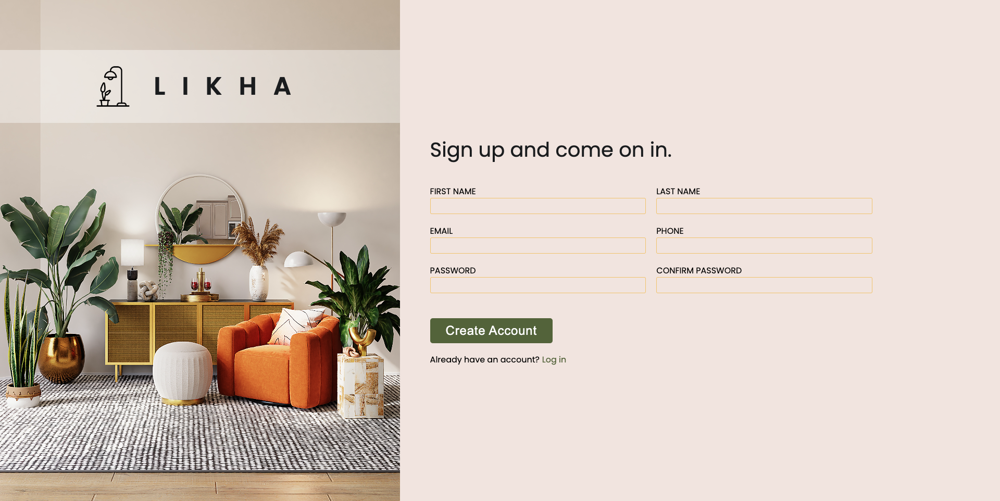
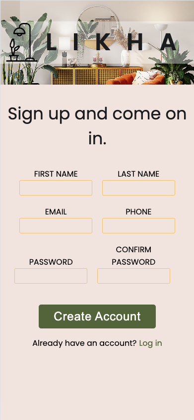

# The Odin Project - Sign-up Form

This is a solution to the [Sign-up Form Project on The Odin Project](https://www.theodinproject.com/lessons/node-path-intermediate-html-and-css-sign-up-form).

## Table of contents

- [Overview](#overview)
  - [Screenshot](#screenshot)
  - [Links](#links)
- [My process](#my-process)
  - [Built with](#built-with)
  - [What I learned](#what-i-learned)
  - [Continued development](#continued-development)
  - [Useful resources](#useful-resources)
- [Author](#author)

## Overview

### Screenshot

### Links

- Solution URL: [https://github.com/amsandiego/odin-sign-up-form](https://github.com/amsandiego/odin-sign-up-form)
- Live Site URL: [https://amsandiego.github.io/odin-sign-up-form](https://amsandiego.github.io/odin-sign-up-form)

## My process

### Built with

- HTML5
- CSS3
- Flexbox

### What I learned

- Using CSS custom properties
- How to properly layout vertical background image with -size, -position, -repeat
- Flex-flow
- Basic RegEx
- Form validation

### Continued development

- Apply mobile-first development

### Useful resources

- [HTML Forms](https://internetingishard.netlify.app/html-and-css/forms/index.html)

## Author

- GitHub - [amsandiego](https://github.com/amsandiego)
